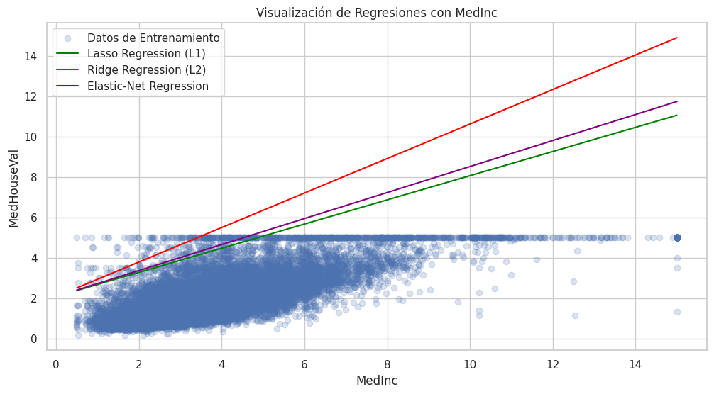
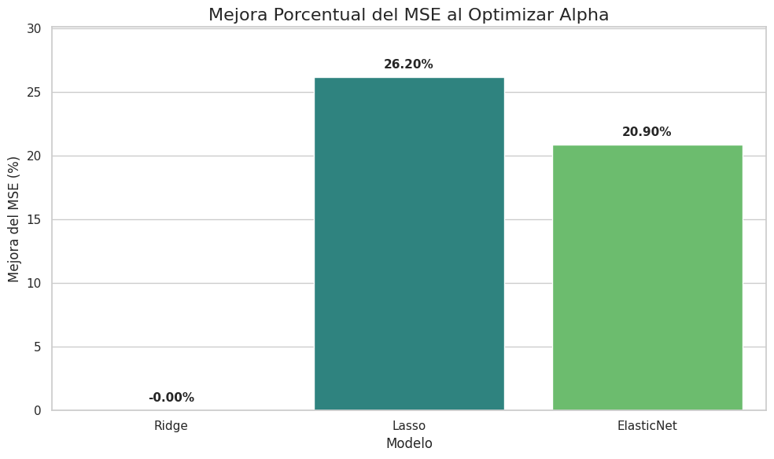
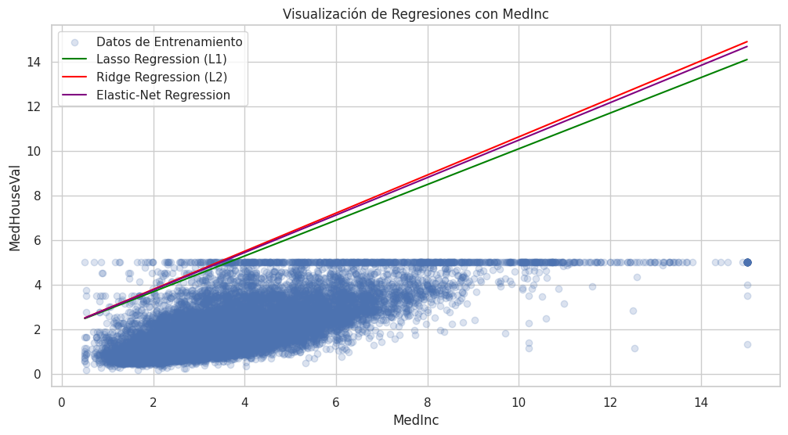

# Primero, ¿qué es una regresión?

La regresión es una técnica de machine learning y estadística que sirve para predecir un valor numérico.

Ejemplo: predecir el precio de una casa según sus metros cuadrados, número de habitaciones, etc.

La más básica es la **regresión lineal** , que intenta encontrar una recta que se ajuste lo mejor posible a los datos.

## ¿Cuál es el problema de la regresión lineal?

Cuando usamos **muchas variables** o cuando los datos son muy ruidosos, la regresión lineal puede:

- Ajustarse demasiado a los datos de entrenamiento ( **overfitting** ).
- Dar coeficientes muy grandes (pesos exagerados para algunas variables), lo que hace que el modelo sea inestable.

Para evitar estos problemas podemos existen otras regresiones que "penalizan" a la regresión lineal para intentar corregir los problemas que podemos encontrar con la regresión lineal simple:

- Regresión L1 o Lasso

- Regresion L2 o Ridge

- Elastic-Net (mezcla de las dos anteriores)

Veamos cada una de las regresiones mencionadas. Todas ellas se basan en el error cuadrático medio (MSE) cuya fórmula es la siguiente:

$$
MSE = \frac{1}{n} \sum_{i=1}^{n} (y_i - \hat{y}_i)^2
$$

- MSE: Error cuadrático medio.

- $n$: El número total de observaciones. 

- $y_i$: Valor real para la observación $i$.

- $\hat{y}_i$: Valor estimado por la regresión para la observación $i$.

# Regresión L1 (Lasso)

La **regresión Lasso (Least Absolute Shrinkage and Selection Operator)** es un tipo de regresión lineal que no solo predice un resultado, sino que también **simplifica el modelo** al seleccionar automáticamente las variables más importantes.  

Imagina que eres un chef y tienes 100 ingredientes disponibles para hacer el mejor plato posible. La **Regresión Lasso** es como tener un asistente muy inteligente que: 

1. **Prueba diferentes combinaciones** de ingredientes 
2. **Elimina automáticamente** los ingredientes que no aportan nada al sabor 
3. **Te deja solo con los ingredientes esenciales** que realmente importan 

En términos técnicos: **Lasso es un algoritmo de regresión que automáticamente selecciona las características más importantes y elimina las irrelevantes, evitando el sobreajuste del modelo.**

La fórmula es la siguiente:

$$
\text{Función de Costo L1} = \underbrace{\text{MSE}}_{\text{Término de Error}} + \underbrace{\lambda \sum_{j=1}^{n} |w_j|}_{\text{Término de Penalización L1}}
$$

Lasso calcula una penalizacion  usando el sumatorio de los valores absolutos de los coeficientes ($w_j$) o pendientes de las variables independientes. La penalización se regula mediante el coeficiente $\lambda$, un valor de 0 hace que la penalización no tenga efecto y solo se utilize el error cuadrático medio. Un valor distinto de 0 hace que la penalización entre en efecto. Cuanto mayor sea $\lambda$, mas variables independientes se descartaran.

## Funcionamiento Básico

**¿Cuándo se usa y por qué es importante?** (con un ejemplo de El Problema que Resuelve)

La regresión Lasso es especialmente útil en situaciones donde hay un gran número de variables predictoras, muchas de las cuales pueden ser irrelevantes o estar altamente correlacionadas. 

- **Selección de variables**: Elimina automáticamente las variables irrelevantes. Esto hace que el modelo sea más simple y fácil de interpretar. 
- **Previene el sobreajuste (overfitting)**: Al simplificar el modelo, Lasso reduce su complejidad y mejora su capacidad para generalizar con nuevos datos. 
- **Maneja la multicolinealidad**: La multicolinealidad ocurre cuando las variables predictoras están altamente correlacionadas entre sí. Lasso puede manejar esto al seleccionar una de las variables correlacionadas y reducir a cero los coeficientes de las otras.

**Regresión Normal:** Si tienes muchas características (variables), el modelo puede “memorizar” los datos de entrenamiento en lugar de aprender patrones generales.  

Es como un estudiante que memoriza las respuestas específicas del examen de práctica pero no entiende los conceptos. 

**Solución Lasso:** Agrega una “penalización” que castiga al modelo por usar demasiadas características, forzándolo a elegir solo las más importantes. 

## ¿Cómo funciona el algoritmo Lasso?

En una regresión normal, el objetivo es **minimizar el error** (que la línea se acerque lo más posible a los puntos). 

En Lasso, además de eso, el algoritmo añade una **penalización**: 

- Si un coeficiente es grande, el algoritmo lo **castiga**. 
- Esa penalización hace que el modelo **prefiera coeficientes más pequeños o incluso cero**. 
- Así, el modelo es más simple, robusto y no se deja engañar por ruido en los datos. 

En palabras simples: 

Lasso dice *“quiero ajustar bien los datos, pero también quiero que mi modelo sea sencillo y con pocas variables importantes

## Casos en los que se usa Lasso

Cuando tienes **muchas variables** y sospechas que no todas son útiles. 

- En datasets con **colinealidad** (variables muy relacionadas entre sí). 
- Cuando quieres un modelo **más interpretable** → Lasso selecciona solo las variables clave. 

Ejemplo real: 

- Predecir el **precio de una casa** usando 100 variables (metros cuadrados, baños, ubicación, año, materiales…).  Con Lasso, el modelo podría quedarse solo con 3 o 4 variables relevantes → mucho más fácil de interpretar. 

- En el sector financiero, se puede utilizar para predecir el precio de una acción. Las variables podrían ser la tasa de interés, el PIB del país, las ganancias de la empresa, etc. Lasso podría determinar que solo las ganancias de la empresa y la tasa de interés son relevantes, ignorando otras variables.

## Casos de Uso y Cuándo Usar Lasso

- **Usa Lasso Cuando:** 
  
  1. **Tienes muchas características:** Especialmente cuando tienes más características que observaciones 
  2. **Sospechas que muchas características son irrelevantes:** Quieres selección automática de características 
  3. **Necesitas interpretabilidad:** Un modelo más simple es más fácil de explicar 
  4. **Quieres prevenir sobreajuste:** En datasets pequeños con muchas variables 

- **Ejemplos de Aplicaciones:** 
  
  - **Medicina:** Identificar genes importantes para una enfermedad entre miles de candidatos 
  
  - **Marketing:** Determinar qué factores realmente influyen en las ventas 
  
  - **Finanzas:** Seleccionar indicadores económicos relevantes para predicciones 
  
  - **Análisis de Texto:** Identificar palabras clave importantes en clasificación de documentos 

## No Uses Lasso Cuando:

- Todas las características son importantes 

- El dataset es muy pequeño (pocas características) 

- Necesitas mantener características correlacionadas juntas

## Importancia y Ventajas

  **Ventajas Clave:** 

1. **Selección Automática:** No necesitas decidir manualmente qué características mantener 
2. **Previene Sobreajuste:** Modelos más generalizables 
3. **Interpretabilidad:** Modelos más simples y explicables 
4. **Eficiencia:** Modelos más rápidos en producción 
5. **Manejo de Multicolinealidad:** Elimina características redundantes

**Por Qué es Importante:**
En el mundo real, frecuentemente tenemos **"la maldición de la dimensionalidad"** - demasiadas características para la cantidad de datos disponibles. Lasso es una herramienta fundamental para crear modelos robustos y prácticos. 

# Regularización L2 (Ridge)

La **regresión Ridge** es una regresión lineal **con penalización L2**. Significa que en la función de error (la que el modelo trata de minimizar) añadimos un término extra que castiga los coeficientes grandes. Con esto, conseguimos que el modelo no se complique demasiado y pueda predecir mejor en datos nuevos. Su fórmula es la siguiente:

$$
\text{Función de Costo Ridge} = \underbrace{\text{MSE}}_{\text{Término de Error}} + \underbrace{\lambda \sum_{j=1}^{n} w_j^2}_{\text{Término de Penalización L2}}
$$

Para calcular la penalización se utiliza el cuadrado de los coeficientes (o pendientes) de las variables independientes ($w_j$). Al usar los cuadrados, la regresión Ridge aproxima alguna de las variables a 0, pero al contrario de la regresión Lasso, nunca llegan a 0 por lo que nunca se descarta ninguna variable independiente. Al igual que en la regresión Lasso, $\lambda$ funciona como un regulador (un valor de 0 la convierte en una regresión lineal simple. Cuanto mas alto es $\lambda$,  mas se penaliza a las variables independientes).

Un ejemplo sencillo: Imagínate que cada variable es como un grifo que llena un cubo de agua (la predicción). En regresión lineal normal, algunos grifos pueden estar **abiertos al máximo** (coeficientes enormes). En regresión Ridge, ponemos un **tope** para que ningún grifo se pase: todos aportan, pero moderadamente.

## Su utilidad es para:

- Evitar el sobreajuste: previene que el modelo se adapte demasiado al conjunto de
    entrenamiento y sea poco útil en nuevos datos. Evita que "memorice" demasiado los datos   viejos y falle con datos nuevos.
- Reducir la multicolinealidad: ayuda cuando las variables independientes (predictoras) están muy correlacionadas entre sí. En estos casos, la regresión lineal normal puede dar coeficientes inestables y exagerados. los coeficientes se mantienen más pequeños y equilibrados, evitando que el modelo dependa demasiado de unas pocas variables o de datos ruidosos. (datos médicos con muchas medidas que se parecen entre sí (colesterol, glucosa, presión), datos financieros con variables muy relacionadas (ingresos, gastos, beneficios)).
- Mejorar la robustez y predicción: permite crear modelos más sólidos frente a variaciones o ruido en los datos, hace que el resultado final sea más confiable.
- Es usado en machine learning para mejorar modelos lineales y también puede aplicarse en regresión logística para clasificaciones.
- En áreas como economía, salud (predicción de enfermedades), y marketing, donde hay
  muchas variables que pueden estar relacionadas, ayuda a obtener modelos más estables y predictivos.

## Conclusión:

La regresión Ridge L2 es una técnica muy útil para evitar que un modelo aprenda demasiado de los datos que tiene (sobreajuste), lo que hace que funcione mejor con datos nuevos. Funciona controlando el tamaño de los números (coeficientes) que usa para dar resultado, haciéndolos más pequeños y estables, especialmente cuando los datos tienen variables muy parecidas o relacionadas.
Aunque añade un poco de error en el ajuste inicial, mejora la capacidad del modelo para generalizar y predecir con mayor precisión en la práctica. Ridge balancea bien la precisión y la estabilidad, siendo ideal cuando se trabaja con muchos datos o variables correlacionadas.

# Regresión Elastic-Net

Es un método de regresión lineal que combina el método de Ride y el de lasso.
Se usa cuando queremos **encoger coeficientes** (evitar sobreajuste) y además **seleccionar
variables** en presencia de alta dimensionalidad o fuerte correlación entre predictores. Su formula es la siguiente:

$$
\text{Función de costo Elastic-Net}  = \underbrace{\text{MSE}}_\text{Término de Error} + \underbrace{\lambda \left[ \alpha \sum_{j=1}^{n} |w_j| + (1 - \alpha) \sum_{j=1}^{n} w_j^2 \right]}_{                        \text{Término de Penalización}}
$$

Elastic-Net es una combinación de Lasso y Ridge en la que la variable $\alpha$ actua como un distribuidor de peso o ratio. Un valor de 1 le da todo el peso a Lasso y un valor de 0 le da todo el peso a Ridge. Valores intermedios entre 0 y 1 asigna mas o menos peso a Lasso y Ridge. El factor de penalización $\lambda$ funciona exactamente igual que en Lasso y Ridge.

## Cuando usar Elastic-Net

Cuando el estudio tiene toneladas de parámetros en los que sospechamos que muchos de ellos son irrelevantes. Las ventajas de Elastic-Net son, entre otras, las siguientes:

- Interpretabilidad: genera modelos lineales con coeficientes claros; las variables con
  coeficiente ≈ 0 se pueden descartar.

- Estabilidad: por la mezcla L2 evita la alta variabilidad de Lasso en presencia de
  colinealidad.

- Escalabilidad: métodos de optimización eficientes (coordinate descent) la hacen
  práctica para problemas grandes.

- Funciona muy bien cuando hay más variables que observaciones.

- No captura interacciones/no linealidades por defecto como otros modelos no lineales, pero es mucho más interpretable y menos propensa a sobreajuste cuando la relación es esencialmente lineal o cuando priorizas interpretabilidad

## Importancia de Elastic-Net

- Muchos problemas reales tienen alta dimensión y correlación entre predictores;
  Elastic Net ofrece un equilibrio práctico entre selección de variables y estabilidad
  numérica.

- Sirve como método “por defecto” cuando ni Ridge ni Lasso son claramente
  superiores.

## Cuando usar Elastic-Net

- Cuando sospechas que hay variables irrelevantes (quieres sparsity) y al mismo
  tiempo hay colinealidad entre variables relevantes.

- Cuando necesitas un modelo interpretable y más estable que Lasso puro.

No lo elijas si la relación es fuertemente no lineal y no puedes transformar variables ni incluir interacciones — ahí modelos no lineales (árboles, boosting, redes) probablemente rinden mejor.

Ejemplos reales de donde usar Elastic-Net:

- Finanzas
  
  **Problema:** Predecir la rentabilidad de un activo usando cientos de indicadores técnicos
  (momentum, medias móviles, ratios, macro variables). 
  
  **Por qué Elastic Net:** muchos indicadores están correlacionados; quieres quedarte con los factores relevantes (sparsity) pero sin eliminar arbitrariamente grupos de indicadores que aportan información conjunta.

- Salud / Genómica
  
  **Problema:** datos de expresión génica (p ≫ n), miles de genes como predictores para
  diagnosticar una enfermedad.
  
  **Por qué Elastic Net:** maneja p≫n, realiza selección de genes relevantes y tiende a
  seleccionar grupos de genes correlacionados , que biológicamente tienen sentido (vías y módulos de coexpresión).

- Marketing / Retail
  
  **Problema:** predecir ventas por SKU con muchas variables (promociones, precios,
  estacionalidad, perfil cliente, señales online).
  
  **Por qué Elastic Net:** hay variables redundantes (precio y descuento, campañas similares). Elastic-Net selecciona las variables importantes y mantiene estabilidad cuando varias campañas están correlacionadas.

- Procesamiento de lenguaje (NLP)
  
  **Problema:** modelos lineales sobre bolsa de palabras / TF-IDF con miles de features.
  
  **Por qué Elastic Net:** reduce dimensionalidad (sparsity) y evita que palabras correlacionadas (sinónimos, formas variantes) sean tratadas de forma errática.

- IoT / Mantenimiento predictivo
  
  **Problema:** cientos de sensores, muchos con señales correlacionadas.
  
  **Por qué Elastic Net:** identifica subconjuntos de sensores relevantes y agrupa señales
  relacionadas evitando sobreinterpretación de ruido.

# Cuadro comparativo de los modelos de regresion

Como punto final, incluimos una tabla comparativa de los 3 modelos mencionados en este documento:

| Propiedad              | Lasso (L1)                 | Ridge (L2)      | Elastic-Net                                |
|:---------------------- |:-------------------------- |:--------------- |:------------------------------------------ |
| Selección de variables | Si (fuerte)                | No              | Si (mas estable)                           |
| Manejo de correlación  | Problemático               | Bueno           | Muy bueno                                  |
| Único global mínimo    | No siempre                 | No siempre      | Si                                         |
| Mejora frente a OLS    | Reduce varianza y sparsity | Reduce varianza | Balance entre varianza y interpretabilidad |

**OLS:** Mínimos Cuadrados Ordinarios (Ordinary Least Squares)

# Anexo

Como  caso práctico de la aplicación de los modelos regresión explicados, vamos a usar un dataset que ya existe en `scikit-learn` y que es el de los precios de las casas en California y que esta compuesto de las siguientes variables:

- **MedInc**. Ingreso medio en el grupo de censo.

- **HouseAge**. Edad media de la vivienda.

- **AveRooms**. Media del número de habitaciones en cada casa.

- **AveBedrms**. Media del número de dormitorios en cada casa.

- **Population**. Número de habitantes en el grupo de censo.

- **AveOcup**. Número de personas en cada casa.

- **Latitude**. Latitud (coordenadas GPS).

- **Longituda**. Longitud (coordenadas GPS).

- **MedHouseVal**. Valor medio de la casa.

Con estos datos, queremos entrenar a un modelo para que nos de el precio de una casa (variable dependiente) con respecto a las otras variables (edad, habitaciones, poblacion...) que vamos a considerarlas independientes.

## Análisis inicial de los datos e identificación de variables.

Un análisis inicial nos muestra que el dataset esta limpio y no es necesario hacer nada con el mismo:

```
dataset Info:
<class 'pandas.core.frame.DataFrame'>
RangeIndex: 20640 entries, 0 to 20639
Data columns (total 9 columns):
 #   Column       Non-Null Count  Dtype  
---  ------       --------------  -----  
 0   MedInc       20640 non-null  float64
 1   HouseAge     20640 non-null  float64
 2   AveRooms     20640 non-null  float64
 3   AveBedrms    20640 non-null  float64
 4   Population   20640 non-null  float64
 5   AveOccup     20640 non-null  float64
 6   Latitude     20640 non-null  float64
 7   Longitude    20640 non-null  float64
 8   MedHouseVal  20640 non-null  float64
dtypes: float64(9)
```

Tal y como hemos comentado, nuestra variable dependiente va a ser el precio de la casa ( `MedHouseVal`)  y el resto de las variables van a ser independientes.

## Preparación de los datos.

En este paso hacemos lo siguiente:

- Crear un dataset con las variables independientes.

- Crear un dataset con las variables dependientes.

- Con los dataset anteriores, creamos los datos de entrenamiento y de pruebas (20% para pruebas, el resto para entrenamiento).

- Escalamos los datos de entrenamiento porque tenemos mas de una variable independiente (práctica común)

## Entrenamiento del modelo Lasso

Con los datos ya preparados, pasamos a entrenar el modelo Lasso. De acuerdo con la fórmula, este modelo nos pide un valor para $\lambda$ al cual le damos un valor arbitrario de `0.2` (usaremos este valor para todos los modelos). Una vez entrenado, el modelo nos da los siguientes coeficientes:

```
Lasso Model Coefficients:
[ 0.59851956  0.         -0.         -0.         -0.         -0.
 -0.         -0.        ]
```

Podemos apreciar que el modelo ha "decidido" ignorar todas las variables independientes excepto para la primera, que es el ingreso medio.

## Entrenamiento del modelo Ridge.

Al igual que con el modelo Lasso, le damos un valor a $\lambda$ de `0.2`. Una vez entrenado, el modelo nos da los siguientes coeficientes:

```
Ridge Model Coefficients:
[ 0.85437179  0.1225618  -0.29437018  0.33920917 -0.00230261 -0.04082989
 -0.8967765  -0.86968745]
```

Tal y como esperamos, este modelo no descarta ninguna variable independiente, pero si que les da algunas de ellas valores cercanos a 0.

## Entrenamiento del modelo Elastic-Net

Recordamos que este modelo es una combinacion de los dos anteriores. Ademas de $\lambda$, necesita un valor $\alpha$ que nos indica el peso que se le da a los modelos Lasso y Ridge. Para nuestro caso, le damos un valor de `0.5`, es decir, el mismo peso a Lasso y Ridge. Una vez entrenado, el modelo nos da los siguientes coeficientes:

```
Elastic-Net Model Coefficients:
[ 0.64386711  0.08940862 -0.         -0.         -0.         -0.
 -0.01498904 -0.        ]
```

Podemos ver la influencia de los modelos Lasso (variables independientes con valor 0) y Ridge (variables independientes con valores cercanos a 0).

## Visualizacion de los modelos

El gráfico siguiente nos da una imagen visual de los modelos. Podemos ver que se comportan de una forma parecida, aunque el modelo Ridge tiene una pendiente (coeficiente) mas pronunciada.



El cálculo del MSE (Error Cuadrático medio) nos da los siguientes valores:

```
Model Performance on the Test Set with arbitrary values for alpha y ratio:

Lasso Regression MSE: 0.7429
Ridge Regression MSE: 0.5559
Elastic-Net Regression MSE: 0.6978
```

Con estos datos, podemos decir que el modelo que mejor se comporta es el Ridge, seguido del Elastic-Net y en ultimo lugar el Lasso.

## Optimización de los modelos

Usar valores arbitrarios para $\lambda$  y $\alpha$ (hiperparametros) no es la mejor solución, puesto que nada nos garantiza que los valores asignados sean los mejores para los modelos esten optimizados (es decir, que predigan valores los mas próximos posibles a los esperados). `scikit-learn` nos da unas herramientas que nos permiten optimizar los modelos a partir de un conjunto de valores para los hiperparametros de los modelos. La optimizacion de nuestros modelos nos da como resultado estos valores para los hiperparametros:

```
Parameter grids defined:
Lasso: {'alpha': [0.01, 0.1, 1, 10, 100]}
Ridge: {'alpha': [0.01, 0.1, 1, 10, 100]}
Elastic-Net: {'alpha': [0.01, 0.1, 1, 10, 100], 'l1_ratio': [0.1, 0.5, 0.9]}

Best hyperparameters for Lasso: {'alpha': 0.01}
Best hyperparameters for Ridge: {'alpha': 0.01}
Best hyperparameters for Elastic-Net: {'alpha': 0.01, 'l1_ratio': 0.1}
```

Observamos que $\lambda$ tiene el mismo valor para todos los modelos y que $\alpha$ le da mucho mas peso al modelo Ridge en Elastic-Net.

Si comparamos los MSE con los obtenidos usando valores arbitrarios, vemos que en los modelos optimizados todos convergen al mismo valor:

```
Model Performance on the Test Set (Tuned Models):

Lasso Regression (Tuned) MSE: 0.5483
Ridge Regression (Tuned) MSE: 0.5559
Elastic-Net Regression (Tuned) MSE: 0.5519

Model Performance on the Test Set with arbitrary values for alpha y ratio:

Lasso Regression MSE: 0.7429
Ridge Regression MSE: 0.5559
Elastic-Net Regression MSE: 0.6978
```

El siguiente gŕafico de barras nos muestra el incremento en porcentaje del rendimiento de los modelos cuando se usan con hiperparametros optimizados:



Por último la imagen visual de los modelos nos muestra que la optimización de los modelos para este caso hace que se comporten de forma muy similar.


